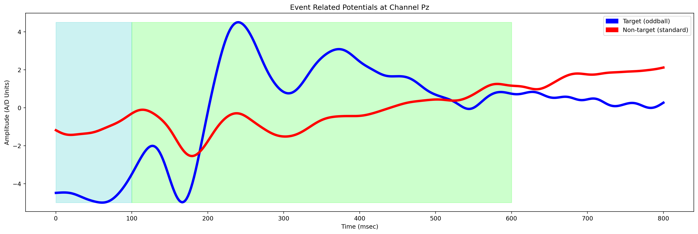
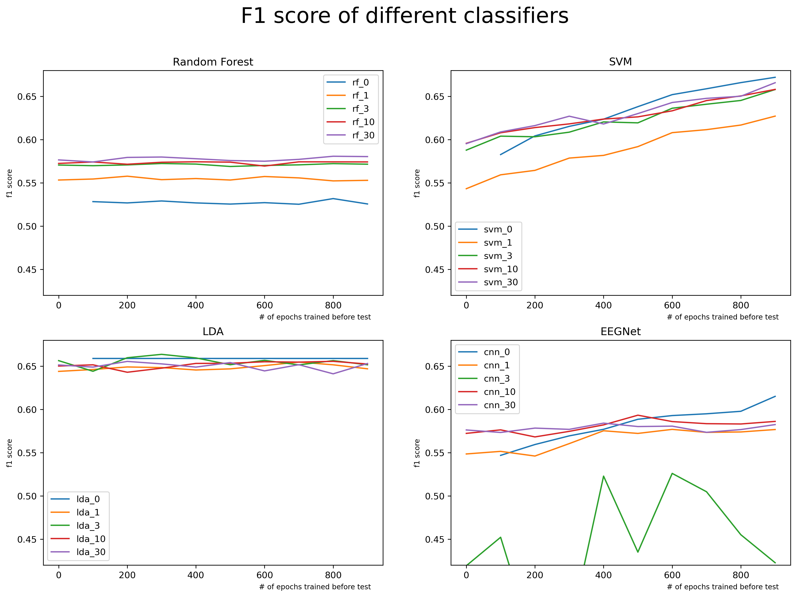

# COGS189-final-project

## [Report](https://github.com/XiaonanFu-ucsd/COGS189-final-project/blob/main/report.pdf)

## Code for this project
- result.ipynb: the final result used in the report. 
- visualization: the code for visualization, used in the report and data analysis. 
- experiment: the code for experiment, used to explore the baseline of each model, and find the optimal hyperparameters.
- train-test: the code for generating pretrained model, and automatically testing on all the models. 
- util: the code for epoching, load epoches, and other utility functions.

# Abstract

For classifying P300 event-related potential, usually need prior knowledge about the EEG signal during the target and non-target stimuli. However, different classifiers need different amounts of data to achieve a usable classification ability. In this final project, I explored 4 different classifiers and compared their generalization performance on one P300 dataset which took place in GIPSA-lab, 2015. The dataset includes 43 participants. There are 4 classifiers involved in this project, which are LDA, SVM, Random Forest, and EEGNet. They are fed with similar epochs, merely adjusted based on each classifier’s requirement. The metric to measure their performance is F1, since the class is imbalanced. The result shows that the LDA has the high and most stable performance, and the SVM shows the potential to have the highest F1 with more data from the same participant who has been tested on. Overall, based on the procedures and implementation used in this project, the number of pretraining date does not impact much on the performance; the different type of classifier shows a relatively greater influence.  
  

  
